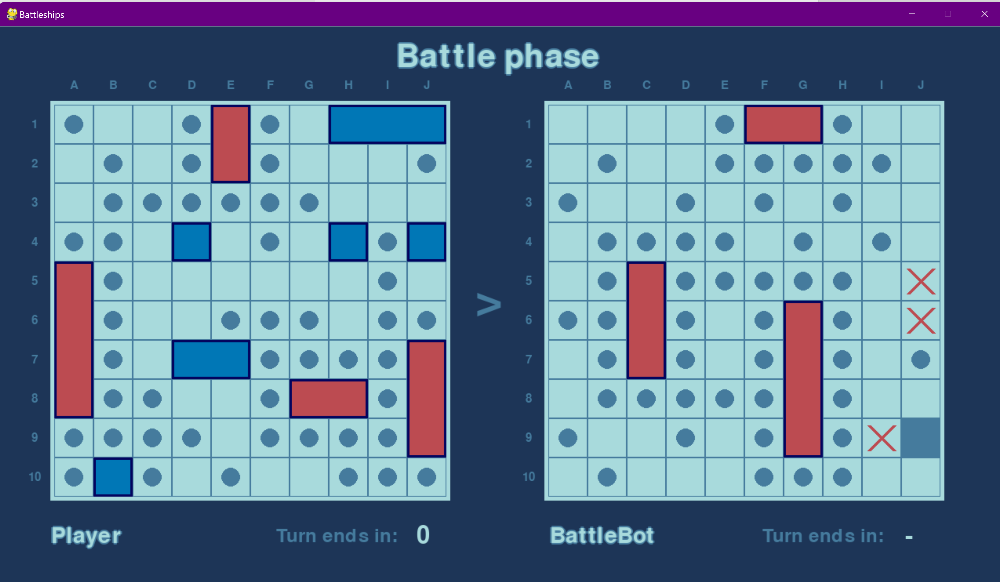
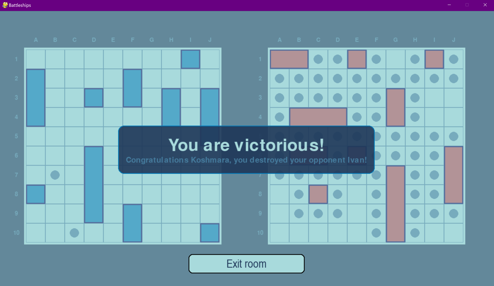

# Battleships Game

## Application interface




## Main Functionalities

### 1. **Multiplayer Mode**

**Compete in Real-Time**: Battle against friends or other players around the world.

- **Create & Join Rooms**: Set up a new room with a unique ID and choose between public or private. Join any room by ID or jump into a random public match.


- **Manage Your Game**: Toggle room privacy, exit when needed, and watch the game start once both players are ready.


- **Turn-Based Battles**: Engage in strategic, turn-based gameplay. The server ensures privacy settings and manages the turn-based gameplay including time per turn validation.


- **Endgame**: The game wraps up when one player's fleet is sunk, or when a player does not make his move in time.

### 2. **Single-Player Mode**

**Face the AI**: Challenge a smart battle bot in a solo game.

- **Quick Setup**: Create a room and the AI bot will join to face you.
- **Automated Challenge**: Enjoy a dynamic game as the bot makes strategic moves and keeps you on your toes.




## Developer's Instructions

To get started with the Battleships Game, follow these steps:

### 1. Install Python

If Python is not already installed on your system, download and install it from the [official Python website](https://www.python.org/downloads/). Ensure you select the appropriate installer for your operating system.

### 2. Clone the Repository

Open a terminal and clone the Battleships Game repository:

```bash
git clone https://github.com/TeogopK/Battleships_Game.git
```

### 3. Navigate to the Project Directory

Change your current directory to the Battleships_Game directory:

```bash
cd Battleships_Game
```

### 4. Create a Virtual Environment

It is recommended to use a virtual environment to manage dependencies. Create a virtual environment named `env`:

```bash
python -m venv env
```

### 5. Activate the Virtual Environment

Activate the virtual environment. The command depends on your operating system:

- **On Windows:**
    ```bash
    .\env\Scripts\activate
    ```

- **On Unix or macOS:**
    ```bash
    source env/bin/activate
    ```

### 6. Install Dependencies

With the virtual environment activated, install the required dependencies:

```bash
pip install -r requirements.txt
```

### 7. Build the Package

To build the project and create a wheel distribution, use:

```bash
python -m build --wheel
```

### 8. Start the Server

To start the server, run. Note that the server IP address should be configured correctly. This may require using tools like `ipconfig` or `ngrok`:

```bash
python -m game.server.multiplayer_server
```

### 9. Start Playing

To start the game, run. Note that the game has an offline mode that does not require the server to be running:

```bash
python -m game.application
```

### 10. Run Tests Using Pytest

To ensure everything is working correctly, run the tests using:

```bash
pytest
```

### 11. Lint and Format the Code

Run Tox to execute linting and formatting checks:

```bash
tox
```

This will perform linting with Pylint and check for code formatting issues.
