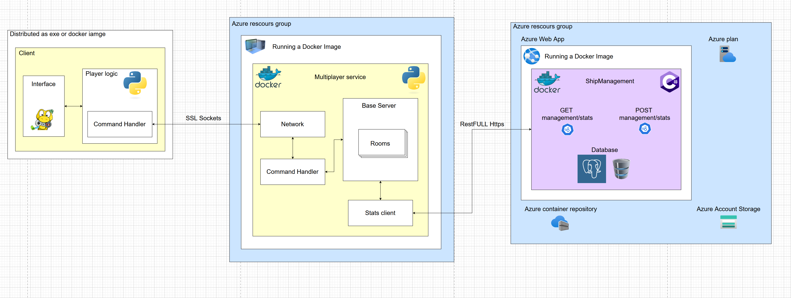

# "Бойни кораби" игра проект

Курс "Проектиране и интегриране на софтуерни системи"
Софтуерно инженерство, ФМИ, СУ, 2024/2025

 

- Даниел Манчевски, 2MI0600094
- Теодор Костадинов, 4MI0600097
  
---

# Идея

Да разработим и интегрираме цялостна клиент-сървър мулитплейър класическа игра "Бойни кораби" .
 
---

# Функционалности 

- Single-player с AI бот
- Multiplayer с мрежова игра
- Система за стаи и кодове
- Интерактивно поставяне на кораби
- Server-side валидация на ходовете
- Таймер за ходове
- API със статистики

---

# Архитектура

---

# Главна система

- **Python** разработка на клиент и сървър
- **Pygame** за графичен потребителски интерфейс
- **Socket** комуникация за мултиплейър
- **Multi-threading** за паралелна обработка на връзки
- **Docker** контейнеризация за по-лесно внедряванe
- **PyInstaller** за създаване на изпълними файлове
---

# Допълнителна система

- **.NET Core 8** разработка
- **REST API** за съхранение и достъп до статистики с HTTPS и JSON
- **PostgreSQL** база данни за съхранение на резултати
- **Swagger** интерфейс за документация и тестване
- **Docker** контейнеризация за по-лесно внедряванe
- **Azure Web App** хостинг.

---

# Комуникационни парадигми

- **Client-Server** архитектура за основната комуникация между играчите и сървъра
- **REST API** и **HTTPS** комуникация за достъп до статистики и данни
- **Socket-based** с mutlithreading комуникация за връзка в реално време между клиентите и мултиплейър сървъра
- **RPC** комуникация за извикване на функции или методи, които се изпълняват на отдалечен сървър

---

# Външна функционалност

- **Pygame** library за Графичен потребителски интерфейс
- **Docker** за контейнеризация и изолация на приложениятa
- **PyInstaller** за създаване на изпълними файлове от Python код 

---

# LIVE DEMO

---

# Заключение

- Интерактивна игра със силна **клиент-сървърна** архитектура.
- Гъвкавост за разширения, базирани на **контейнеризация и облачни** услуги.
- Възможност за бъдещо развитие на функционалностите.
- Проектът демонстрира приложението на **теоретични** знания **на практика** и създава солидна основа за **бъдещи иновации.**

---

# Благодарим за вниманието!